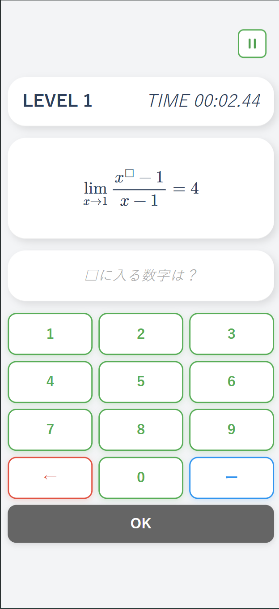
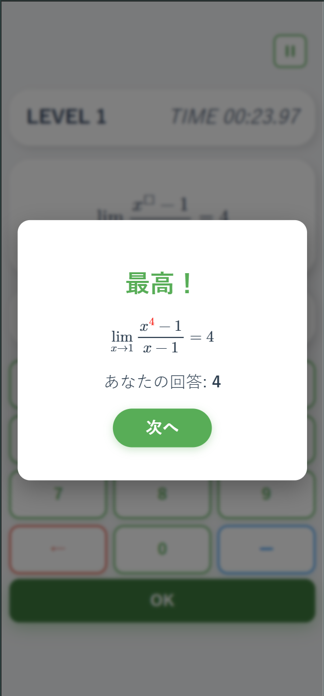
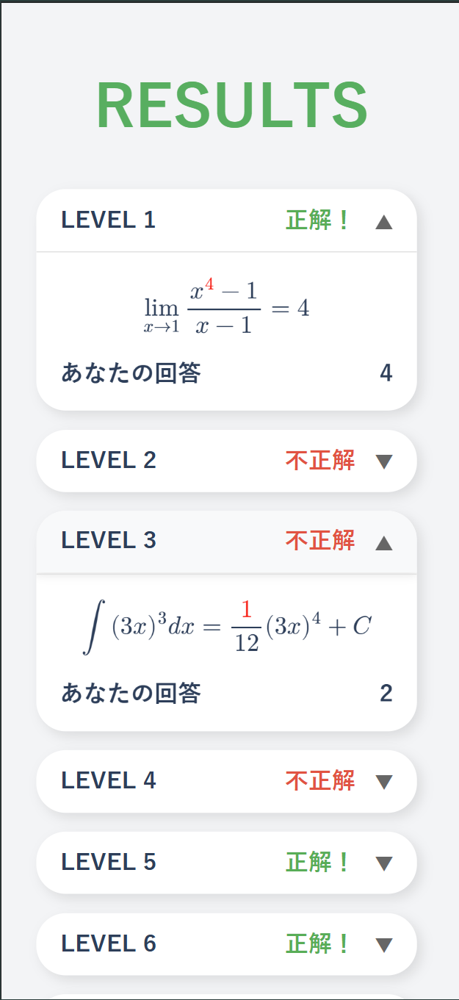
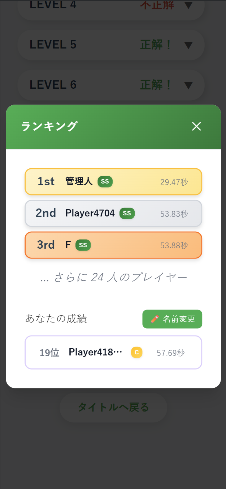

# 🐛理系虫食い算（Advanced Worm-eaten Calculations）

***□にあてはまる数を書きなさい。***

## 📖 概要

このゲームは以前作成したゲーム「[虫食い算](https://github.com/k-mysa6505/musikui/)」の進化版です．

数式の一部が虫に食べられたという設定で，食べられた数字を当てるクイズゲームです．

This is a quiz game in which you have to guess the number of the equation that has been eaten by a worm.

[click here to play](https://rikei-musikui.vercel.app)

  
  
  
  

## 新機能・特徴
- 理系に特化した出題範囲（数学Ⅲ（微積・極限）～大学1，2年程度）
- 解答フィードバックの表示
- 結果画面における，解いた問題の一覧表示
- 基本の7問を全問正解したユーザーに向けた，ハイレベル問題の出題
- 全ユーザーの成績を集計して，上位3位をランキング表示

## ランク基準

正答率と回答時間によって5段階（S～D）にランクをつけています．
ハイレベル問題に正解すると1段階上がります．

### 基本ランク（正答率 × 回答時間）
| ランク | 正答率 | 回答時間 |
|:---:|:---:|:---:|
| 🥇 **S** | 100% | 90秒以内 |
| 🥈 **A** | 70%以上 | 150秒以内 |
| 🥉 **B** | 40%以上 | 240秒以内 |
| 🏅 **C** | 10%以上 | 480秒以内 |
| 📝 **D** | 10%未満 | 時間問わず |

### ランクアップボーナス
**ハイレベル問題正解** → **1ランク昇格**
- A → S，B → A，C → B，D → C
- **Sランク + ハイレベル正解 = SS（最高ランク）**

## 🛠 技術スタック

| 技術 | 用途 |
|:--- |:--- |
| ⚛️ React | UI構築・状態管理 |
| 📜 TypeScript | ゲームロジック |
| 📐 MathJax | 数式表示 |
| 🔥 Firebase | 成績集計 |

## 📜 ライセンス

本リポジトリの内容はMITライセンスです。[LICENSE](LICENSE)をご参照ください。

## 🙏 Special Thanks

**Claude Sonnet 4**
*開発補助 & 技術サポート*
